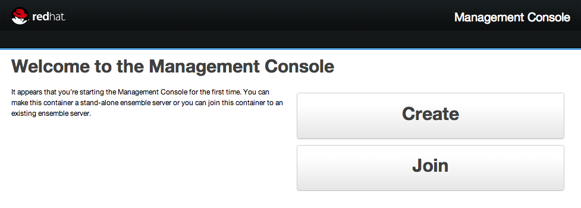
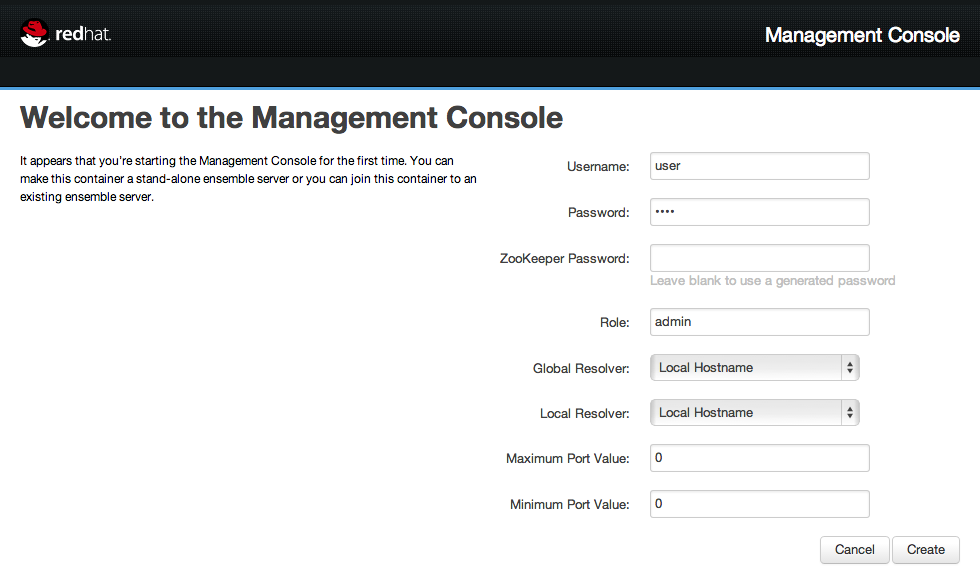
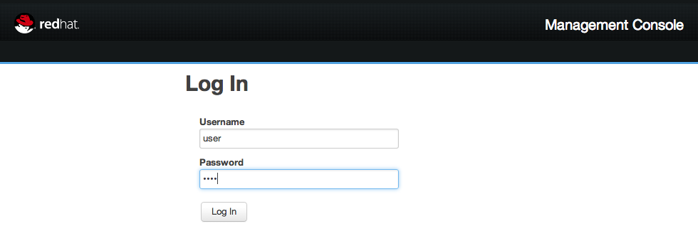
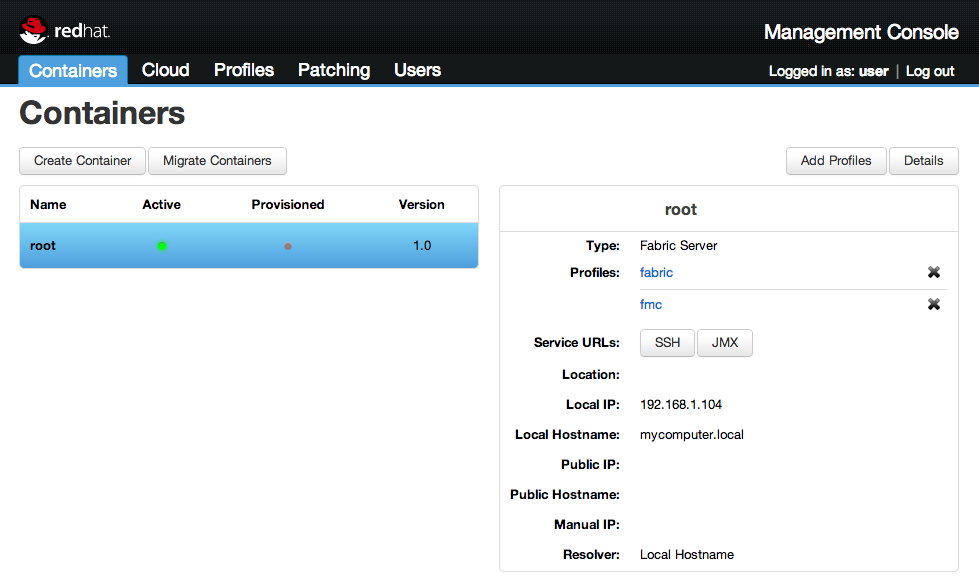
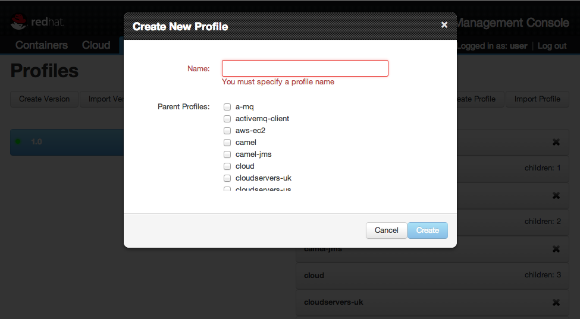
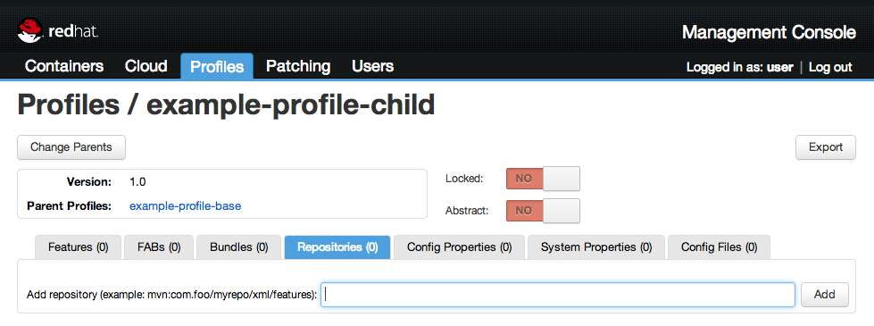
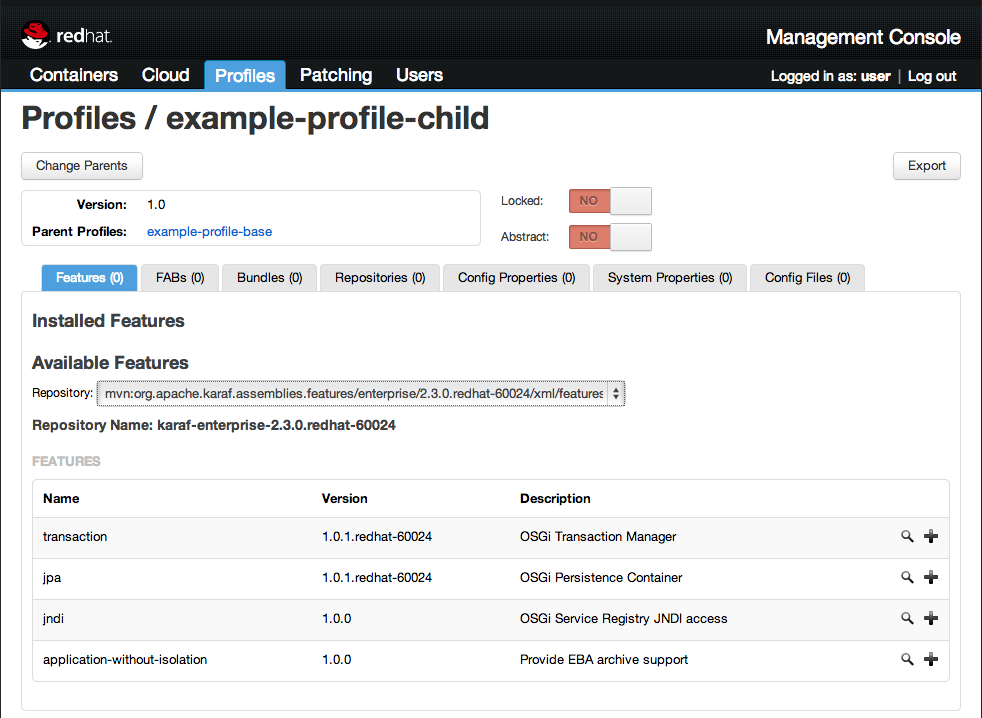
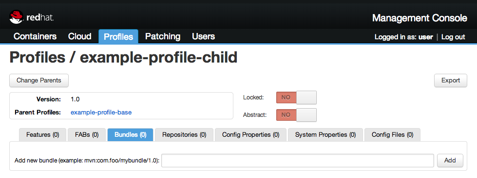
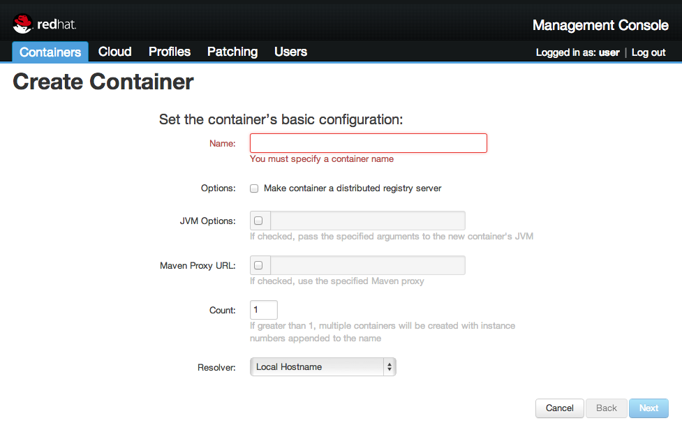
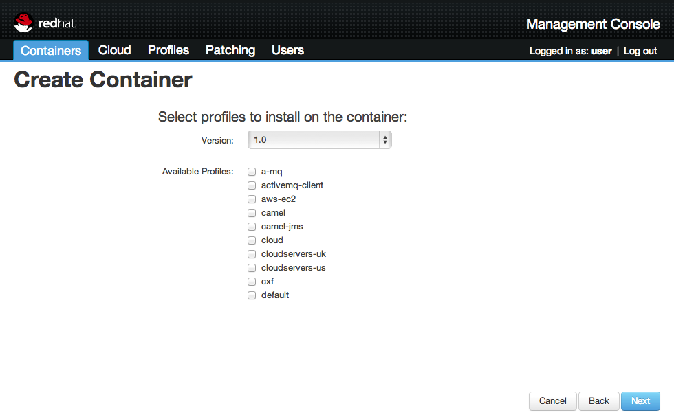

# Managing a Deployment using Fuse Fabric

## Overview
[Fuse Fabric][] is a runtime environment that leverages capabilities of [Apache Karaf][], the container underlying JBoss
Fuse, to provide centralized configuration and provisioning capabilities. In brief, [Fuse Fabric][]
provides the ability to create container instances running locally or remotely, including on cloud environments like
Amazon EC2 and Rackspace. You can then create and apply Profiles that define what OSGi bundles and associated
configurations (name / value pairs) to apply to each managed container.

Management Console provides a web-based user interface to make it easier to interact with Fuse Fabric than
Fabric’s provided command-line interface.

## Prerequisites

* Maven 3.0.3 or higher
* JDK 1.6 or 1.7
* JBoss Fuse 6

## Installing the Management Console

1. Start JBoss Fuse 6 by running `bin/fuse` (on Linux) or `bin\fuse.bat` (on Windows).
2. In the JBoss Fuse console, enter the following command to install the `fabric-webui` feature:

    JBossFuse:karaf@root> features:install fabric-webui

3. Once the server has started, open a webbrowser an go to the [Management Console interface][].

## Logging into the Management Console

Open a web browser and go to the [Management Console interface][].

Click the `Create` button if this is your first time running and configure a `Username`, `Password` and an optional
 `ZooKeeper Password` for the ensemble server. Since we're only going to use the local system to host our containers, 
 you can skip the other fields.

Click the `Create` button and log in with your brand new credentials. If you where only provided with a login option
 instead of the regastration form, the default user is `admin` with password `amdin`.
 

Once you're logged in you can see the tab-bar at the top, the list of containers on the left and some container information on the right.

### Creating Profiles

*Profiles* have an inheritance concept where parent profile’s configuration and bundles are applied fully before the
child profiles. It is a good practice to create parent profiles for common configurations shared across your
applications. Using parent profiles can also help ensure dependent bundles are fully deployed **before** child profile
bundles. To be clear, Fuse Fabric only has a single concept called *Profile*, and they act as parent or child purely
based on their relationship to other profiles, that is when you create a profile you can specify zero of more other
profiles (which may also have parent profiles) to be the parent of the profile you are creating.

Select the `Profiles` tab, and push the `Create Profile` button on upper right. You will be prompted to enter a name,
and select zero or more Parent Profiles.

It is recommended to create a base profile for your project wich has the `camel` and the `karaf` profile as his parent. 
Then create a child bundle of this base for each feature or each independend group of bundles (Do not forget to point 
to your base bundle as a parent).

#### Adding a feature to a profile

In most cases, a project is divided into features which can be installed by using `features:install featurename`. These 
features are usually a good fit for creating profiles. 

To edit the a profile's settings, select the profile from the profiles list in the profiles tab. Head to the 
`Repositories` tab and add the maven url of the features file (for example: 
`mvn:org.fusesource.example.examplename/modulename/0.0.1-SNAPSHOT/xml/features`)

Browse to the `Features` tab and select the repository you just added. The defined features from features file will 
appear at the bottom. Add a feature to the profile by clicking the `+` button on the right.

Repeat this for each of the *child* profiles you created.

#### Adding a bundle to a profile

If you want to add individual bundles to a profile, select the profile from the profiles list in the profiles tab. 
Head to the `Bundles` tab and add the maven url of the bundle (for example: 
`mvn:org.fusesource.example.examplename/modulename/0.0.1-SNAPSHOT/`)

Repeat this for each of the bundles you want to add to the profile.

### Creating Containers

Fuse Fabric allows you to create managed Containers to which you can deploy one or more profiles. A managed
Container is initially a minimal [Apache Karaf][] instance with a Fuse Fabric agent bundle deployed. 

Select the `Containers` tab, and press the `Create Container` button. You will be prompted to enter a name for the 
container. 

Press `Next` in the lower right. You will then be prompted to select the zero or more Profiles to
initial provision the container with. Select one or more profiles you created, and press `Next`. 

At the next form leave the defaults for now, and press `Next` and then `Finish`.

At this point, it will create a new Container instance, and initially provision it with the profile you selected. In the 
upper right of the Container tab, you can select the `Detail` button to see more information on the deployed Container, 
including drilling into seeing the deployed Camel routes.

To deploy extra profiles to a bundle, push the `Add Profiles` button with your created Container, and add the 
containers by selecting them from the list.
 
To deploy an entire project, add all the profiles to one container or create multiple containers and divide the 
profiles amongst them. Most bundles or features can communicate between containers out of the box but some might need 
a few changes to lookup each other's endpoints. 

[Fuse Fabric]: http://fuse.fusesource.org/fabric/index
[Apache Karaf]: http://karaf.apache.org
[Management Console interface]: http://localhost:8181/